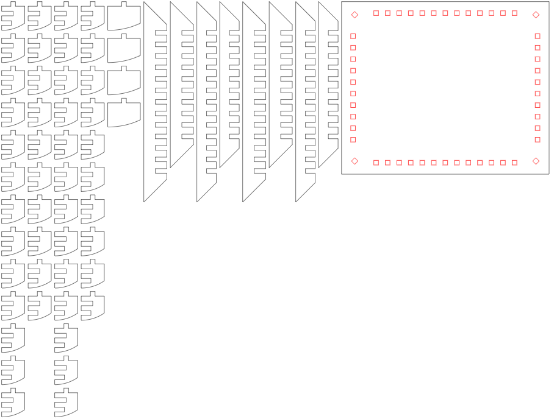

# SphereBase For LaserCut
  Generate SVG File to create SphereBase shape by lasercut.

## Requirement
  Assuming you installed python 3.9.10 or newer version.  
  Require svgwrite installed using pip.  
  Require PySide2 installed using pip.  
  Require webbrowser installed using pip.  

## Usage
- 1. Execute SphereBase.py (with command "python SphereBase.py")
- 2. Input Parameters.  

- 3. lasercut_spherebase.svg is saved on the current working directory.  

